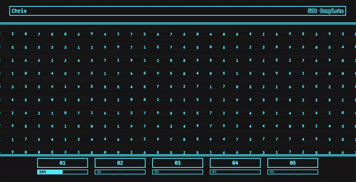

# Lumon Terminal Pro

A browser recreation of the Lumon Industries terminal from Apple TV's *Severance*. All the effects are pure CSS: drifting scanlines, outlined cyan numbers, a subtle per-digit bounce, `mix-blend-difference` on the percentage bar, and layered outline/fill typography on the header.



I wrote about the CSS tricks that go into it — [read the walkthrough on my blog](https://chrisporter.org/projects/lumon).

## Running it

```bash
npm install
npm run dev
```

Then open http://localhost:5173.

## Stack

React 19, TypeScript, Vite, Tailwind.
